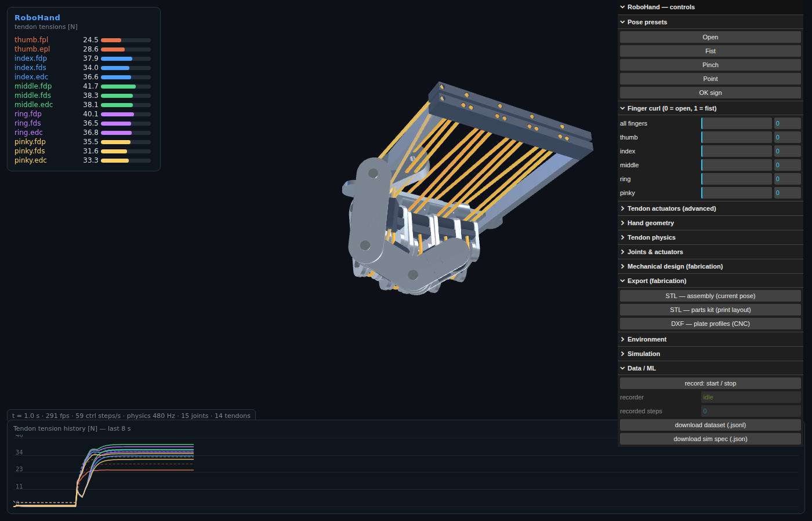

# RoboHand — parametryczny symulator dłoni robota napędzanej ścięgnami

Aplikacja 3D (przeglądarka, Three.js) do parametrycznego symulowania manipulatora —
dłoni robota humanoidalnego o architekturze ścięgnowej (tendon-driven), z pełną
telemetrią naprężeń w ścięgnach i interfejsem przygotowanym pod integrację z ML/RL.



## Szybki start

```bash
npm install
npm run dev            # aplikacja 3D na http://localhost:5173
npm run demo:headless  # rdzeń fizyki w Node, bez przeglądarki (ścieżka ML)
npm run build          # bundel produkcyjny do dist/
npm run typecheck      # kontrola typów
```

## Architektura

```
src/
  sim/            RDZEŃ FIZYKI — czysty TypeScript, ZERO zależności od DOM/Three.js
    types.ts        typy parametrów, obserwacji, specyfikacji ML i fabrykacji (MechParams)
    math3.ts        minimalna algebra 3D (mat3/vec3)
    mechGeometry.ts geometria fabrykacyjna (płaskowniki, kanały) + limity mechaniczne stawów
    defaultHand.ts  parametryczny builder dłoni (proporcje ludzkie, 14 ścięgien)
    simulator.ts    kinematyka + dynamika + model ścięgien, step API
    presets.ts      mapowanie "curl" palców → akcje ścięgien, gotowe pozy
    animations.ts   zapętlone presety animacji (funkcje czasu → curls)
    recorder.ts     rejestrator datasetów JSONL
  viz/            wizualizacja Three.js
    scene.ts        scena, kamera, oświetlenie IBL
    parts.ts        fabryka brył (płaskowniki, bloki z kanałami, sworznie, płyty)
    handView.ts     złożenie 3D napędzane FK symulatora + trasowanie ścięgien
    hud.ts/plot.ts  telemetria naprężeń (tabela + wykres czasowy)
  export/         eksport STL (złożenie / zestaw części) i DXF (profile płaskowników)
  ui/             panel sterowania (lil-gui), pobieranie plików
  main.ts         pętla stałego kroku czasowego, spięcie całości
scripts/
  headless-demo.ts      przykład użycia rdzenia w Node (pętla jak w środowisku RL)
  check-tendon-twist.ts  regresja: ciągłość orientacji ścięgien w całym zakresie zgięcia
```

Rozdział `sim/` od `viz/` jest celowy: **ten sam kod fizyki** działa w przeglądarce
i headless w Node — środowisko treningowe RL importuje `HandSimulator` bezpośrednio,
bez przeglądarki i bez renderowania.

## Model fizyczny

Każdy palec to szeregowy łańcuch przegubów obrotowych (zgięciowych):
kciuk CMC–MP–IP, pozostałe palce MCP–PIP–DIP (15 przegubów łącznie).

Ścięgna modelowane są jako elastyczne cięgna prowadzone przez bloczki (pulleys)
o stałych ramionach momentu, napinane przez aktuatory liniowe (silnik + szpula):

| Wielkość | Wzór |
|---|---|
| wycieczka ścięgna | `e(q) = Σⱼ signⱼ · rⱼ · qⱼ` |
| rozciągnięcie | `s = pretension + xₐ − e(q)` |
| naprężenie | `T = max(0, k·s + c·ṡ)` — ścięgno nie pcha |
| moment w stawie | `τⱼ += signⱼ · rⱼ · T` |
| aktuator | `ẋₐ = (u·maxPull − xₐ)/τ_act` — człon inercyjny I rzędu |

Do tego: pasywna sztywność i tłumienie torebki stawowej, miękkie limity stawów,
momenty grawitacyjne liczone z kinematyki prostej (masy paliczków), efektywna
bezwładność stawu z mas dystalnych. Całkowanie: semi-implicit Euler ze stałym
krokiem (domyślnie fizyka 480 Hz, krok sterowania 60 Hz) — **w pełni
deterministyczne** (ten sam ciąg akcji ⇒ identyczna trajektoria, co potwierdza
zgodność wyników headless i w przeglądarce co do bitów).

### Układ ścięgien (antropomorficzny)

- każdy palec: **FDP** (zginacz głęboki, MCP+PIP+DIP), **FDS** (zginacz
  powierzchowny, MCP+PIP), **EDC** (prostownik, grzbietowo przez wszystkie stawy),
- kciuk: **FPL** + **EPL**,
- razem **14 ścięgien = 14-wymiarowa przestrzeń akcji**.

Prostowniki mają napięcie wstępne (pretension) i działają jak sprężyny powrotne —
sprzężenie zgięcia stawów wynika naturalnie ze wspólnego prowadzenia ścięgna,
tak jak w rzeczywistych dłoniach ścięgnowych.

## Projekt mechaniczny (druk 3D / CNC)

Każdy paliczek to realna, fabrykowalna konstrukcja, nie bryła poglądowa:

- **dwa boczne płaskowniki** (stadium: prostokąt + półokrągłe końce) z otworami
  na sworzeń zawiasu na obu końcach — linki na przemian widelec zewnętrzny/
  wewnętrzny, żeby sąsiednie ogniwa się zazębiały ze szczeliną montażową,
- **bloki prowadzące** (dłoniowy + grzbietowy) łączące płaskowniki, z wierconymi
  kanałami na ścięgna — średnica i głębokość kanału **dokładnie na promieniu
  ramienia momentu z symulacji fizyki** (ten sam parametr napędza i dynamikę, i
  geometrię),
- **sworznie zawiasowe** (styl clevis-pin: trzpień + łepek) łączące kolejne ogniwa,
- **podkładka opuszka** na ostatnim paliczku każdego palca.

Dłoń (rama, nie „pudełko"): dwie szyny boczne biegnące od nadgarstka do palców,
**przedni trawers** niosący uchwyty (języczki) palców, i **tylny trawers**
(belki dłoniowa + grzbietowa z wierconymi kanałami) gdzie kończą się wszystkie
14 ścięgien — lekka, prosta w druku/wycięciu konstrukcja (4 płaskie części)
zamiast poprzedniej kanapki z dwóch płyt i dystansów.

**Mocowanie kciuka** jest budowane inaczej niż pozostałych 4 palców. Kciuk
opozycyjny ma bazową rotację przechyloną tak mocno (żeby przy zgięciu
naturalnie krzyżował się z palcami), że gdyby jego języczek mocujący
„wystawał" w tym samym kierunku co u zwykłych palców (prosto do tyłu w jego
własnej, mocno obróconej ramce), materiał tego języczka wjeżdżałby wprost w
wiązkę ścięgien pozostałych palców przechodzącą przez wnętrze ramy — dokładnie
to było widać jako kolizję. Kierunek, w którym języczek faktycznie wystaje, to
czysto konstrukcyjny wybór niezwiązany z kinematyką stawu (musi tylko
współdzielić oś zawiasu) — więc dla każdego palca liczony jest kierunek
„do tyłu" rzutowany prostopadle do osi zawiasu, i odwracany tylko wtedy, gdy
inaczej niósłby języczek w stronę osi symetrii dłoni zamiast od niej. Dla 4
zwykłych palców (niemal zerowa rotacja bazowa) reguła nic nie zmienia; dla
kciuka odwraca kierunek, wyprowadzając języczek bezpiecznie na zewnątrz szyny.

Sam **model wspornika kciuka jest inny** niż płaski języczek pozostałych
palców (`thumbBracket` vs `stadiumPlate`): przy złożonym kącie kciuka symetryczny
języczek albo wystawał poza ramę, albo kolidował. Dedykowany wspornik ma:
(1) **piastę zawiasu z otworem na sworzeń** (bolec) w osi stawu CMC,
(2) **dłoniowy występ z wierconym otworem-prowadnicą na cięgno** (FPL) — otwór
leży dokładnie na promieniu ramienia momentu, więc cięgno owijające sworzeń
przechodzi przez niego, a część pełni rolę prowadnicy cięgna,
(3) **ścięte, płaskie lico montażowe** (zamiast okrągłej „czapki"), które
dosiada do ramy zamiast w nią wchodzić.

**Trasowanie ścięgien** nie idzie prostą cięciwą przez staw (co przy dużym
zgięciu wcinałoby się w blok prowadzący) — ścięgno owija sworzeń łukiem
(interpolacja sferyczna orientacji ogniwa poprzedniego → następnego), tak jak
prawdziwa cięgno robi na bloczku. Rurka 3D ścięgna ma też **własną, jawnie
liczoną orientację przekroju w każdym punkcie** (z rzeczywistych macierzy
obrotu stawów), a nie automatyczne "ramki Freneta" z three.js — te potrafią się
złamać (widoczne jako skręcenie rurki) przy niemal równoległych odcinkach.
Sprawdzone automatycznym testem regresyjnym (`npm run check:tendon-twist`):
zamiatanie zgięcia 0→1 dla wszystkich palców, zero nieciągłości orientacji.

**Mechaniczne limity stawów** („collidery" jako zakresy, nie pełna symulacja
kolizji): maksymalne zgięcie każdego stawu jest przycinane do kąta, przy którym
bloki prowadzące sąsiednich ogniw geometrycznie by się nie zmieściły (funkcja
`computeMechJointLimits` w `sim/mechGeometry.ts` — półkąt zajętości bloku
`atan(głębokość_kanału / odsunięcie_od_sworznia)` po obu stronach stawu). Limit
ten wchodzi do tej samej sprężyny miękkiego ograniczenia stawu, której już
używa fizyka — więc wynik jest spójny w symulacji i w wizualizacji.

## Parametry (panel „RoboHand — controls")

- **Pose presets** — Open / Fist / Pinch / Point / OK sign (statyczne),
- **Finger curl** — zadawanie zgięcia per palec (mapowane na antagonistyczne pary ścięgien),
- **Animation loops** — zapętlone, ciągłe w czasie sekwencje zgięć:
  Grasp cycle (rytmiczne zaciskanie/otwieranie), Finger wave (fala palców
  z opóźnieniem fazowym index→pinky), Piano tap (niezależne stukanie każdym
  palcem), Pinch cycle (cykliczny szczypiec kciuk-wskazujący). Każda animacja
  to czysta funkcja czasu (`src/sim/animations.ts`), więc działa też headless.
  Dowolna ręczna zmiana (preset, suwak, aktuator) zatrzymuje aktywną animację,
  „■ stop" wraca do sterowania ręcznego bez zmiany bieżącej pozy,
- **Tendon actuators (advanced)** — bezpośrednie zadawanie 14 aktuatorów (0–1),
- **Hand geometry** — skala globalna, długość/grubość palców, promienie bloczków,
- **Tendon physics** — sztywności zginaczy/prostowników, tłumienie, pretension, próg bezpiecznego naprężenia,
- **Joints & actuators** — sztywność/tłumienie stawów, stała czasowa i skok aktuatorów,
- **Mechanical design (fabrication)** — grubość płaskowników, średnica sworznia,
  luz montażowy, średnica kanału na ścięgno, minimalna ścianka, grubość płyty dłoni,
- **Environment** — grawitacja (włącznik + wartość g),
- **Simulation** — pauza, skala czasu, liczba podkroków fizyki, reset pozy,
- **Data / ML** — nagrywanie datasetu, pobranie `.jsonl` i specyfikacji `.json`,
- **Export (fabrication)** — STL złożenia w bieżącej pozie, STL zestawu części
  rozłożonych do druku, DXF profili płaskowników do CNC/lasera.

Zmiany parametrów przebudowują model **na żywo z zachowaniem stanu** (o ile
topologia stawów/ścięgien się nie zmienia).

## Pomiary naprężeń

- HUD (lewy górny róg): naprężenie każdego ścięgna w N + pasek względem progu
  bezpieczeństwa (czerwony kolor przy przeciążeniu),
- ścięgna w 3D kolorowane naprężeniem: niebieski → żółty → czerwony,
- dolny panel: przebieg czasowy naprężeń wszystkich ścięgien
  (prostowniki linią przerywaną).

## Integracja z ML

### API symulatora (przeglądarka lub Node)

```ts
import { buildHandParams } from './src/sim/defaultHand';
import { HandSimulator } from './src/sim/simulator';

const sim = new HandSimulator(buildHandParams());
const spec = sim.getSpec();       // pełna specyfikacja przestrzeni akcji/obserwacji
let obs = sim.reset();
obs = sim.step(action);           // action: number[14] w [0,1] — cele aktuatorów
// obs: { time, q[15], qd[15], tendonTension[14], tendonExcursion[14],
//        tendonStretch[14], actuatorPosition[14], actuatorTarget[14],
//        fingertipPositions[15] }
const flat = HandSimulator.flattenObservation(obs); // wektor dla sieci
```

W przeglądarce symulator jest dostępny z konsoli / zewnętrznego harnessa jako
`window.robohand` (m.in. `sim`, `recorder`, `setCurls({...})`).

### Specyfikacja (przycisk „download sim spec")

`SimSpec` zawiera: `actionSpace` (box [0,1]¹⁴ z nazwami ścięgien),
`observationSpace` (pola + etykiety każdego wymiaru), kroki czasowe oraz
**pełne drzewo parametrów dłoni** — dataset jest samoopisujący się i
odtwarzalny.

### Format datasetu (JSONL)

```
{"type":"spec","spec":{...}}                        ← nagłówek
{"type":"step","t":0.0167,"action":[...],"obs":{...}}
{"type":"step","t":0.0333,"action":[...],"obs":{...}}
```

## Mapa rozwoju

- kontakt i chwytanie obiektów (kolizje palce–obiekt, siły chwytu) — obecne
  limity mechaniczne zapobiegają tylko przenikaniu się WŁASNYCH części dłoni,
- abdukcja/addukcja MCP i kciuka (dodatkowe DOF + ścięgna międzykostne),
- mostek WebSocket/Python (gymnasium env) nad rdzeniem `sim/`,
- tarcie ścięgno–bloczek (model Capstan), elastyczność nieliniowa,
- eksport/import konfiguracji dłoni jako JSON.
